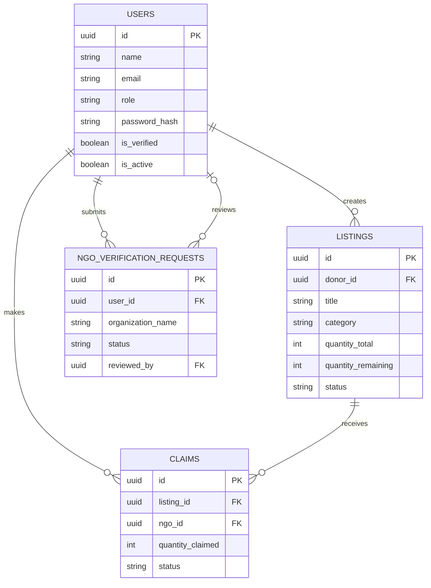

# WarmShare — Technical Design Document (TDD)

**Project:** WarmShare — Winter Clothing Donation and Distribution Platform  
**Document Type:** Technical Design Document (TDD)  
**Version:** 1.0  
**Status:** Initial Technical Design  
**Development Type:** Solo Academic Project  
**Frontend:** React.js with TypeScript  
**Backend:** FastAPI with Python  
**Database:** PostgreSQL  
**Architecture:** REST API  
**Repository:** [2311080-Warmshare](https://github.com/shaikaislamarpita/2311080-Warmshare)

---

# 1. Introduction

## 1.1 Purpose

This Technical Design Document describes the proposed architecture, components, database structure, API interfaces, authentication mechanisms, authorization model, and deployment strategy for WarmShare.

It translates the requirements defined in the Product Requirements Document (PRD) and Software Requirements Specification (SRS) into a technical implementation plan.

The document serves as a reference for development, testing, maintenance, and the midterm and final demonstrations.

## 1.2 System Overview

WarmShare is a full-stack web application that enables donors to list unused winter clothing and NGO volunteers to reserve and collect specific quantities.

The application consists of:

1. A React and TypeScript frontend.
2. A FastAPI backend written in Python.
3. A PostgreSQL relational database.
4. REST APIs connecting the frontend and backend.

The system will be developed in two releases.

### MVP — Midterm

- Donation listing CRUD.
- Listing browsing and filtering.
- Quantity-based donation claims.
- Claim release and collection completion.
- Database persistence.
- Basic React frontend.
- REST API integration.
- Local execution.

### Beta — Final

- User registration and login.
- JWT authentication.
- Role-Based Access Control.
- FastAPI security scopes.
- Resource ownership validation.
- NGO verification.
- User profiles and dashboards.
- Admin management.
- Deployment.

## 1.3 Design Principles

WarmShare will follow these principles:

- Separation of frontend and backend.
- RESTful API communication.
- Modular code organization.
- Server-side validation.
- Database transaction consistency.
- Least-privilege authorization.
- Reusable frontend components.
- Simple and maintainable implementation.
- Incremental development through MVP and Beta.

---

# 2. Technology Stack

| Layer | Technology | Purpose | Release |
|---|---|---|---|
| Frontend | React.js | User interface | MVP |
| Language | TypeScript | Type-safe frontend development | MVP |
| Build Tool | Vite | Frontend development and build | MVP |
| Routing | React Router | Client-side navigation | MVP |
| HTTP Client | Axios | REST API communication | MVP |
| Styling | CSS | Responsive interface styling | MVP |
| Backend | FastAPI | REST API development | MVP |
| Language | Python | Backend development | MVP |
| ORM | SQLAlchemy | Database operations | MVP |
| Validation | Pydantic | Request and response validation | MVP |
| Database | PostgreSQL | Persistent relational storage | MVP |
| Database Migration | Alembic | Schema version management | MVP |
| API Documentation | OpenAPI/Swagger UI | API testing and documentation | MVP |
| Authentication | OAuth2 Password Flow and JWT | User authentication | Beta |
| Password Security | Argon2-based password hashing | Secure password storage | Beta |
| Authorization | FastAPI Security Scopes | Fine-grained API permissions | Beta |
| Version Control | Git and GitHub | Source control and collaboration workflow | MVP/Beta |
| Deployment | Suitable frontend, backend, and PostgreSQL hosting | Public application access | Beta |

The project will avoid unnecessary frameworks and external services.

---

# 3. High-Level System Architecture

## 3.1 Architecture Diagram

```text
+--------------------------------------+
|         React + TypeScript           |
|              Frontend                |
|                                      |
|  Pages, Forms, Dashboards, Routing   |
+------------------+-------------------+
                   |
                   | HTTP/HTTPS
                   | JSON REST APIs
                   |
                   v
+--------------------------------------+
|            FastAPI Backend           |
|                                      |
|  API Routers                         |
|  Pydantic Validation                 |
|  Business Logic                      |
|  Authentication (Beta)               |
|  RBAC and Security Scopes (Beta)      |
+------------------+-------------------+
                   |
                   | SQLAlchemy ORM
                   |
                   v
+--------------------------------------+
|          PostgreSQL Database         |
|                                      |
|  Users                               |
|  Listings                            |
|  Claims                              |
|  NGO Verification Requests (Beta)    |
+--------------------------------------+
```

## 3.2 Component Responsibilities

### Frontend

Responsible for:

- Displaying donation listings.
- Collecting user input.
- Calling backend APIs.
- Displaying validation and error messages.
- Managing navigation.
- Managing authentication state during Beta.
- Rendering role-specific dashboards during Beta.

### Backend

Responsible for:

- Validating incoming requests.
- Executing listing and claim operations.
- Enforcing business rules.
- Managing database transactions.
- Preventing overclaiming.
- Authenticating users during Beta.
- Enforcing roles, scopes, and ownership during Beta.

### Database

Responsible for:

- Persisting users, listings, and claims.
- Maintaining relationships.
- Enforcing database constraints.
- Supporting transaction-safe quantity updates.
- Storing NGO verification records during Beta.

---

# 4. Proposed Repository Structure

The project will use a monorepo containing both frontend and backend applications.

```text
2311080-Warmshare/
|
|-- frontend/
|   |-- public/
|   |-- src/
|   |   |-- api/
|   |   |-- components/
|   |   |-- pages/
|   |   |-- layouts/
|   |   |-- hooks/
|   |   |-- context/
|   |   |-- routes/
|   |   |-- types/
|   |   |-- App.tsx
|   |   |-- main.tsx
|   |-- package.json
|   |-- tsconfig.json
|   |-- vite.config.ts
|
|-- backend/
|   |-- app/
|   |   |-- api/
|   |   |   |-- routes/
|   |   |-- core/
|   |   |-- models/
|   |   |-- schemas/
|   |   |-- services/
|   |   |-- db/
|   |   |-- main.py
|   |-- alembic/
|   |-- tests/
|   |-- requirements.txt
|   |-- alembic.ini
|
|-- docs/
|   |-- 01-prd.md
|   |-- 02-srs.md
|   |-- 03-tdd.md
|
|-- .gitignore
|-- README.md
```

Only the documentation and initial repository files are required for Task 1. Application folders will be implemented in later development tasks.

---

# 5. Frontend Technical Design

## 5.1 Frontend Architecture

The frontend will use React functional components with TypeScript.

Main responsibilities will be separated into:

- Pages for complete screens.
- Components for reusable UI elements.
- API modules for HTTP communication.
- Types for TypeScript interfaces.
- Routes for navigation.
- Context for shared authentication state during Beta.

## 5.2 MVP Pages

| Page | Description |
|---|---|
| Home | Introduction to WarmShare |
| Browse Listings | Displays available donations |
| Listing Details | Displays donation information and remaining quantity |
| Create Listing | Form for creating donations |
| Edit Listing | Form for updating donations |
| Claim Management | Displays and manages demo NGO claims |

## 5.3 Beta Pages

| Page | Description |
|---|---|
| Register | User registration |
| Login | User authentication |
| Profile | View and update profile |
| Donor Dashboard | Manage owned listings and received claims |
| NGO Dashboard | Manage claims and verification status |
| Admin Dashboard | Manage users, verification, and statistics |
| NGO Verification | Submit and review verification requests |

## 5.4 API Communication

Axios will be used to communicate with FastAPI.

A centralized API client will:

- Define the backend base URL.
- Send JSON requests.
- Handle API errors.
- Attach authentication tokens during Beta.
- Use environment configuration for API URLs.

The frontend will not directly access PostgreSQL.

## 5.5 Frontend Routing

React Router will handle navigation.

During MVP, listing and claim pages will be accessible for local demonstration.

During Beta, protected routes will redirect unauthenticated users to login.

Frontend route protection is intended for usability. Backend authorization remains mandatory.

## 5.6 State Management

React hooks will manage local component state.

React Context will manage shared authentication state during Beta.

A separate state-management library is not required for the initial project.

---

# 6. Backend Technical Design

## 6.1 Backend Architecture

FastAPI will follow a modular layered structure.

```text
HTTP Request
     |
     v
API Router
     |
     v
Pydantic Validation
     |
     v
Service Layer
     |
     v
SQLAlchemy ORM
     |
     v
PostgreSQL
```

During Beta, authentication and authorization dependencies will be executed before protected business operations.

## 6.2 Backend Modules

| Module | Responsibility | Release |
|---|---|---|
| Listings Router | Listing CRUD and filtering | MVP |
| Claims Router | Claim, release, and collection operations | MVP |
| Listing Service | Listing business rules | MVP |
| Claim Service | Quantity reservation and claim transitions | MVP |
| Database Module | Database sessions and connection management | MVP |
| Models | SQLAlchemy table definitions | MVP |
| Schemas | Pydantic request/response models | MVP |
| Authentication Router | Registration and login | Beta |
| Security Module | JWT validation and scopes | Beta |
| NGO Router | Verification workflow | Beta |
| Admin Router | Administrative operations | Beta |
| Statistics Service | Platform statistics | Beta |

## 6.3 Dependency Injection

FastAPI dependencies will be used for:

- Database session access.
- Current authenticated user retrieval.
- Role validation.
- Security scope validation.

This reduces duplicated code and keeps endpoints maintainable.

## 6.4 Request Validation

Pydantic schemas will validate:

- Required fields.
- Enumerated values.
- Positive quantities.
- Valid email addresses.
- Data types and field lengths.

Business rules involving current database state will be checked in service functions.

---

# 7. Database Design

## 7.1 Database Overview

PostgreSQL will be the primary database.

The initial database will contain three main tables:

1. `users`
2. `listings`
3. `claims`

The Beta release will add:

4. `ngo_verification_requests`

The MVP will use seeded donor and NGO records in the `users` table without authentication.

## 7.2 Users Table

**Table:** `users`

| Column | Data Type | Constraints | Release |
|---|---|---|---|
| id | UUID | Primary Key | MVP |
| name | VARCHAR(100) | NOT NULL | MVP |
| email | VARCHAR(255) | UNIQUE, NOT NULL | MVP |
| role | VARCHAR(20) | NOT NULL | MVP |
| password_hash | VARCHAR(255) | Nullable in MVP; required for Beta accounts | Beta |
| is_verified | BOOLEAN | DEFAULT FALSE | Beta |
| is_active | BOOLEAN | DEFAULT TRUE | Beta |
| created_at | TIMESTAMP WITH TIME ZONE | NOT NULL | MVP |

Allowed roles:

- `donor`
- `ngo`
- `admin`

Public registration will not allow users to select the Admin role.

## 7.3 Listings Table

**Table:** `listings`

| Column | Data Type | Constraints |
|---|---|---|
| id | UUID | Primary Key |
| donor_id | UUID | Foreign Key to users.id |
| title | VARCHAR(150) | NOT NULL |
| category | VARCHAR(30) | NOT NULL |
| size | VARCHAR(30) | Nullable |
| age_group | VARCHAR(20) | NOT NULL |
| gender | VARCHAR(20) | NOT NULL |
| condition | VARCHAR(20) | NOT NULL |
| quantity_total | INTEGER | Greater than 0 |
| quantity_remaining | INTEGER | Greater than or equal to 0 |
| pickup_address | TEXT | NOT NULL |
| status | VARCHAR(30) | NOT NULL |
| created_at | TIMESTAMP WITH TIME ZONE | NOT NULL |
| updated_at | TIMESTAMP WITH TIME ZONE | NOT NULL |

Allowed categories:

- `jacket`
- `sweater`
- `blanket`
- `shawl`
- `socks`

Allowed conditions:

- `like_new`
- `good`
- `worn`

Allowed listing statuses:

- `available`
- `fully_claimed`
- `withdrawn`

Database constraints will enforce:

- `quantity_total > 0`
- `quantity_remaining >= 0`
- `quantity_remaining <= quantity_total`

The status `fully_claimed` indicates zero remaining quantity. It does not necessarily mean all items have been physically collected.

## 7.4 Claims Table

**Table:** `claims`

| Column | Data Type | Constraints |
|---|---|---|
| id | UUID | Primary Key |
| listing_id | UUID | Foreign Key to listings.id |
| ngo_id | UUID | Foreign Key to users.id |
| quantity_claimed | INTEGER | Greater than 0 |
| status | VARCHAR(20) | NOT NULL |
| claimed_at | TIMESTAMP WITH TIME ZONE | NOT NULL |
| collected_at | TIMESTAMP WITH TIME ZONE | Nullable |

Allowed claim statuses:

- `claimed`
- `released`
- `collected`

A claim represents a single reservation.

Released and collected claims remain stored for history and statistics.

## 7.5 NGO Verification Requests Table — Beta

**Table:** `ngo_verification_requests`

| Column | Data Type | Constraints |
|---|---|---|
| id | UUID | Primary Key |
| user_id | UUID | Foreign Key to users.id |
| organization_name | VARCHAR(150) | NOT NULL |
| registration_number | VARCHAR(100) | Nullable |
| status | VARCHAR(20) | NOT NULL |
| submitted_at | TIMESTAMP WITH TIME ZONE | NOT NULL |
| reviewed_at | TIMESTAMP WITH TIME ZONE | Nullable |
| reviewed_by | UUID | Nullable Foreign Key to users.id |

Allowed verification statuses:

- `pending`
- `approved`
- `rejected`

The system will prevent duplicate pending requests for the same NGO account.

---

# 8. Entity Relationship Diagram



## 8.1 Relationships

- One Donor can create many Listings.
- One Listing can have many Claims.
- One NGO Volunteer can create many Claims.
- One NGO Volunteer can submit verification requests.
- One Admin can review multiple verification requests.

Foreign key constraints will maintain referential integrity.

---

# 9. REST API Design

All application endpoints will use the `/api/v1` prefix.

## 9.1 MVP — Listing APIs

| Method | Endpoint | Description | SRS Reference |
|---|---|---|---|
| POST | `/api/v1/listings` | Create listing | FR-01 |
| GET | `/api/v1/listings` | View and filter listings | FR-02, FR-06 |
| GET | `/api/v1/listings/{id}` | View listing details | FR-03 |
| PUT | `/api/v1/listings/{id}` | Update listing | FR-04 |
| DELETE | `/api/v1/listings/{id}` | Delete eligible unused listing | FR-05 |
| PATCH | `/api/v1/listings/{id}/withdraw` | Withdraw eligible listing | FR-05 |

## 9.2 MVP — Claim APIs

| Method | Endpoint | Description | SRS Reference |
|---|---|---|---|
| POST | `/api/v1/claims` | Create claim | FR-08, FR-09 |
| GET | `/api/v1/claims` | View demo claims | FR-12 |
| PATCH | `/api/v1/claims/{id}/release` | Release active claim | FR-10 |
| PATCH | `/api/v1/claims/{id}/collect` | Complete collection | FR-11 |

During MVP, the claim creation request will include the ID of a seeded NGO user.

During Beta, the NGO identity will be obtained from the authenticated user instead of trusting a client-supplied NGO ID.

## 9.3 Beta — Authentication APIs

| Method | Endpoint | Description | SRS Reference |
|---|---|---|---|
| POST | `/api/v1/auth/register` | Register user | FR-15 |
| POST | `/api/v1/auth/login` | Authenticate user | FR-16 |
| GET | `/api/v1/auth/me` | Retrieve current user | FR-18 |
| PATCH | `/api/v1/users/me` | Update own profile | FR-18 |

The login endpoint will use OAuth2-compatible form data and return a JWT access token.

Logout will initially be implemented on the frontend by clearing its authentication state.

## 9.4 Beta — NGO Verification APIs

| Method | Endpoint | Description | SRS Reference |
|---|---|---|---|
| POST | `/api/v1/ngo/verification` | Submit verification request | FR-22 |
| GET | `/api/v1/ngo/verification/me` | View own verification status | FR-22 |
| GET | `/api/v1/admin/ngo-verifications` | View verification requests | FR-23 |
| PATCH | `/api/v1/admin/ngo-verifications/{id}/approve` | Approve request | FR-23 |
| PATCH | `/api/v1/admin/ngo-verifications/{id}/reject` | Reject request | FR-23 |

## 9.5 Beta — Administration APIs

| Method | Endpoint | Description | SRS Reference |
|---|---|---|---|
| GET | `/api/v1/admin/users` | View users | FR-25 |
| PATCH | `/api/v1/admin/users/{id}/role` | Update permitted role | FR-25 |
| DELETE | `/api/v1/admin/listings/{id}` | Moderate eligible listing | FR-26 |
| GET | `/api/v1/admin/stats` | View statistics | FR-27 |

## 9.6 Beta — User-Specific APIs

| Method | Endpoint | Description |
|---|---|---|
| GET | `/api/v1/listings/mine` | Donor's own listings |
| GET | `/api/v1/listings/{id}/claims` | Claims on donor's listing |
| GET | `/api/v1/claims/mine` | NGO's own claims |

Specific routes such as `/listings/mine` must be declared before dynamic routes such as `/listings/{id}` to prevent routing conflicts.

---

# 10. API Request and Response Examples

## 10.1 Create Donation Listing — MVP

**Request**

`POST /api/v1/listings`

```json
{
  "donor_id": "11111111-1111-4111-8111-111111111111",
  "title": "Winter Jackets",
  "category": "jacket",
  "size": "M",
  "age_group": "adult",
  "gender": "unisex",
  "condition": "good",
  "quantity_total": 10,
  "pickup_address": "Dhaka, Bangladesh"
}
```

The example `donor_id` represents a seeded MVP demo user. It will be omitted from the client request in Beta.

**Response — 201 Created**

```json
{
  "id": "22222222-2222-4222-8222-222222222222",
  "title": "Winter Jackets",
  "category": "jacket",
  "quantity_total": 10,
  "quantity_remaining": 10,
  "status": "available"
}
```

## 10.2 Create Donation Claim — MVP

**Request**

`POST /api/v1/claims`

```json
{
  "listing_id": "22222222-2222-4222-8222-222222222222",
  "ngo_id": "33333333-3333-4333-8333-333333333333",
  "quantity_claimed": 6
}
```

**Response — 201 Created**

```json
{
  "id": "44444444-4444-4444-8444-444444444444",
  "listing_id": "22222222-2222-4222-8222-222222222222",
  "quantity_claimed": 6,
  "status": "claimed",
  "quantity_remaining": 4
}
```

## 10.3 Insufficient Quantity

If only 4 items remain and an NGO requests 5:

**Response — 409 Conflict**

```json
{
  "detail": "Insufficient available quantity"
}
```

No claim will be created and the stored remaining quantity will remain unchanged.

---

# 11. Quantity-Based Claim Transaction Design

## 11.1 Objective

The backend must prevent overclaiming, including when multiple requests are submitted simultaneously.

For example:

- A listing contains 5 remaining items.
- NGO A requests 4 items.
- NGO B simultaneously requests 4 items.

Both requests must not succeed.

## 11.2 Atomic Reservation Strategy

PostgreSQL will be used to perform a conditional update inside a database transaction.

Example SQL:

```sql
UPDATE listings
SET quantity_remaining = quantity_remaining - :requested_quantity
WHERE id = :listing_id
  AND status <> 'withdrawn'
  AND quantity_remaining >= :requested_quantity
RETURNING id, quantity_remaining;
```

If the statement returns no row, the backend rejects the claim.

If the update succeeds, the backend creates the claim record in the same transaction.

Both operations must commit together.

## 11.3 Transaction Workflow

```text
Receive claim request
        |
        v
Validate quantity
        |
        v
Begin database transaction
        |
        v
Atomically reserve quantity
        |
        +---- No row updated
        |          |
        |          v
        |      Rollback
        |          |
        |          v
        |      HTTP 409
        |
        v
Create claim record
        |
        v
Commit transaction
        |
        v
Return successful claim
```

## 11.4 Claim Release

Claim release must also be transaction-safe.

The backend will:

1. Lock the claim row.
2. Verify that its status is `claimed`.
3. Change the status to `released`.
4. Restore the reserved quantity to the listing.
5. Update listing availability.
6. Commit the transaction.

If the claim is already released or collected, the operation must be rejected.

This prevents repeated release requests from restoring the same quantity multiple times.

## 11.5 Collection Completion

Collection completion will:

1. Lock the claim row.
2. Verify that the claim is active.
3. Update its status to `collected`.
4. Store the collection timestamp.
5. Commit the transaction.

Collection completion will not increase remaining quantity.

## 11.6 Listing Updates and Withdrawal

Listing updates and withdrawal operations must coordinate with claim transactions.

The backend will use database transactions and appropriate row locking to ensure that a listing cannot be withdrawn while a new claim is being successfully reserved.

Changes to total quantity must preserve existing claim history and quantity consistency.

---

# 12. Authentication Design — Beta

## 12.1 Authentication Mechanism

WarmShare will use OAuth2 Password Flow with JWT access tokens.

The general flow is:

```text
User enters credentials
        |
        v
React sends login request
        |
        v
FastAPI verifies credentials
        |
        v
Backend creates JWT
        |
        v
Frontend receives token
        |
        v
Token included in protected requests
        |
        v
FastAPI validates token
```

## 12.2 Password Storage

Passwords will not be stored as plain text.

An Argon2-based password hashing implementation will be used.

The backend will verify submitted passwords against stored hashes.

## 12.3 JWT Design

JWT access tokens will contain a minimal set of claims, such as:

- Subject/user ID.
- Expiration time.
- Issued-at time.
- Authorized scopes, where appropriate.

The backend will validate:

- Token signature.
- Expiration.
- User existence and active status.
- Required permissions.

Role changes must take effect on subsequent authorization checks. The backend will use current server-side user permissions rather than relying exclusively on potentially outdated token scopes.

## 12.4 Token Handling

For the initial Beta implementation:

- Access tokens will be short-lived.
- The frontend will keep authentication state in memory.
- Tokens will be attached to protected API requests.
- Logout will clear client-side authentication state.
- A refresh-token system is not required for the initial project.

A previously issued token may remain valid until expiration unless explicit server-side revocation is added.

---

# 13. Role-Based Access Control — Beta

## 13.1 Roles

The system will support:

- Donor.
- NGO Volunteer.
- Admin.

## 13.2 Role Permission Matrix

| Operation | Donor | NGO Volunteer | Admin |
|---|---|---|---|
| Create listing | Yes | No | No |
| Update own listing | Yes | No | No |
| Withdraw own listing | Yes | No | No |
| Browse listings | Yes | Yes | Yes |
| Create claim | No | Verified only | No |
| Release own claim | No | Yes | No |
| Complete own claim | No | Yes | No |
| View own claims | No | Yes | No |
| View claims on own listings | Yes | No | Yes |
| Verify NGO | No | No | Yes |
| Manage users | No | No | Yes |
| Moderate listings | No | No | Yes |
| View statistics | No | No | Yes |

## 13.3 Authorization Workflow

```text
Protected API Request
        |
        v
Validate JWT
        |
        v
Load current user
        |
        v
Check required role
        |
        v
Check security scopes
        |
        v
Check resource ownership
        |
        v
Execute operation
```

For NGO claim creation, verification status must also be checked.

---

# 14. FastAPI Security Scopes — Beta

FastAPI's `Security` dependency will enforce required scopes.

## 14.1 Scope Definitions

| Scope | Description |
|---|---|
| `listings:create` | Create donation listings |
| `listings:update_own` | Update owned listings |
| `listings:withdraw_own` | Withdraw owned listings |
| `listings:read` | Browse listings |
| `claims:create` | Create claims |
| `claims:release_own` | Release owned claims |
| `claims:complete` | Complete owned claims |
| `claims:read_own` | View owned claims |
| `claims:read_on_own_listings` | View claims on owned listings |
| `users:verify_ngo` | Review NGO verification requests |
| `users:manage_roles` | Manage user roles |
| `listings:delete` | Moderate eligible listings |
| `stats:read` | View statistics |

## 14.2 Authorization Example

Conceptual FastAPI implementation:

```python
from fastapi import APIRouter, Security

router = APIRouter()

@router.post("/listings")
def create_listing(
    current_user=Security(
        get_current_user,
        scopes=["listings:create"]
    )
):
    # Validate donor role
    # Validate listing data
    # Save listing
    pass
```

`get_current_user` will be implemented in the security module.

A security scope grants permission to attempt an operation, but resource ownership and business rules must still be validated.

## 14.3 Ownership Checks

Example conditions:

**Listing update:**

```python
listing.donor_id == current_user.id
```

**Claim release:**

```python
claim.ngo_id == current_user.id
```

**Claim creation:**

```python
current_user.role == "ngo"
and current_user.is_verified
```

Admin privileges do not automatically bypass business rules or ownership restrictions unless an explicit administrative endpoint allows that operation.

---

# 15. NGO Verification Design — Beta

## 15.1 Verification Workflow

```text
NGO Volunteer registers
          |
          v
Account is unverified
          |
          v
Submit verification request
          |
          v
Status: Pending
          |
          v
Admin reviews request
          |
       +--+--+
       |     |
       v     v
   Approved Rejected
       |
       v
NGO may create claims
```

## 15.2 Verification Rules

- Only NGO Volunteer accounts may submit verification requests.
- Only Admins may approve or reject requests.
- Duplicate pending requests are not permitted.
- Approval updates the NGO account's verification status.
- Rejection does not grant claim permission.
- Claim creation checks verification status at request time.

---

# 16. Error Handling Design

The backend will use standard HTTP status codes.

| Status | Meaning | Example |
|---|---|---|
| 200 | Successful request | Retrieve listing |
| 201 | Resource created | Create claim |
| 204 | Successful deletion | Delete eligible listing |
| 401 | Authentication required or invalid | Invalid JWT |
| 403 | Forbidden | Insufficient role or scope |
| 404 | Resource not found | Unknown listing |
| 409 | Business conflict | Insufficient quantity |
| 422 | Validation error | Negative quantity |
| 500 | Unexpected server error | Unhandled server failure |

FastAPI exception handlers will return consistent JSON errors.

Unexpected exceptions will be logged on the server without exposing sensitive implementation details to users.

---

# 17. Security Considerations

## 17.1 MVP Security

The MVP will:

- Validate all request data.
- Use parameterized database operations through SQLAlchemy.
- Apply database constraints.
- Prevent overclaiming.
- Keep database credentials in environment variables.
- Restrict local demonstration access.

MVP write endpoints will not be publicly deployed without authentication.

## 17.2 Beta Security

The Beta release will additionally implement:

- Secure password hashing.
- JWT validation.
- Role-Based Access Control.
- Security scopes.
- Resource ownership checks.
- NGO verification.
- HTTPS.
- Restricted CORS origins.
- Secure environment configuration.
- Authorization testing.

## 17.3 Privacy

Pickup addresses are sensitive location information.

During MVP, addresses will be fictional demonstration data.

During Beta, full pickup addresses will be restricted to authorized parties. Public listing views will display only a general pickup area where appropriate.

The application will not store unnecessary personal information about donation recipients.

---

# 18. Testing Strategy

## 18.1 MVP Tests

| Test ID | Scenario | Expected Result |
|---|---|---|
| T-MVP-01 | Create valid listing | Listing created |
| T-MVP-02 | Create listing with zero quantity | Validation error |
| T-MVP-03 | Retrieve listings | Correct data returned |
| T-MVP-04 | Update listing | Changes persisted |
| T-MVP-05 | Claim available quantity | Claim created and quantity reduced |
| T-MVP-06 | Claim more than available | HTTP 409 |
| T-MVP-07 | Concurrent claims | No overclaiming |
| T-MVP-08 | Release active claim | Quantity restored |
| T-MVP-09 | Release claim twice | Second release rejected |
| T-MVP-10 | Complete collection | Status updated |
| T-MVP-11 | Release collected claim | Rejected |
| T-MVP-12 | Restart application | Data remains stored |
| T-MVP-13 | React API integration | Data displayed correctly |

## 18.2 Beta Tests

| Test ID | Scenario | Expected Result |
|---|---|---|
| T-BETA-01 | Register user | Account created |
| T-BETA-02 | Login with correct credentials | Token returned |
| T-BETA-03 | Login with incorrect credentials | HTTP 401 |
| T-BETA-04 | Access protected endpoint without token | HTTP 401 |
| T-BETA-05 | Donor updates another donor's listing | HTTP 403 |
| T-BETA-06 | Unverified NGO creates claim | HTTP 403 |
| T-BETA-07 | Admin approves NGO | Verification updated |
| T-BETA-08 | Non-admin approves NGO | HTTP 403 |
| T-BETA-09 | Missing required security scope | HTTP 403 |
| T-BETA-10 | Deployed frontend calls backend | Request succeeds |
| T-BETA-11 | Access protected dashboard without login | Redirected |
| T-BETA-12 | Invalid JWT | HTTP 401 |

## 18.3 Testing Tools

Planned tools include:

- Pytest.
- FastAPI TestClient or HTTPX.
- FastAPI Swagger UI.
- Browser developer tools.
- Manual React interface testing.

Database transaction tests will use PostgreSQL to verify behavior consistent with production.

---

# 19. Deployment Design — Beta

## 19.1 Deployment Architecture

```text
User Browser
     |
     | HTTPS
     v
React Frontend Hosting
     |
     | HTTPS REST API
     v
FastAPI Backend Hosting
     |
     | Secure DB Connection
     v
PostgreSQL Database
```

## 19.2 Deployment Requirements

- Build React for production.
- Run FastAPI using a production-compatible ASGI server.
- Configure database connection settings.
- Configure approved CORS origins.
- Set JWT signing secrets through environment variables.
- Apply database migrations.
- Enable HTTPS.
- Verify API connectivity.

## 19.3 Environment Variables

Example backend configuration:

```text
DATABASE_URL=...
JWT_SECRET_KEY=...
JWT_ALGORITHM=HS256
ACCESS_TOKEN_EXPIRE_MINUTES=30
FRONTEND_ORIGIN=...
```

Example frontend configuration:

```text
VITE_API_BASE_URL=...
```

Actual credentials and secret values must never be committed to GitHub.

An `.env.example` file may document required variable names without exposing real secrets.

---

# 20. Development and GitHub Workflow

WarmShare will use an issue-driven Git workflow.

```text
Create GitHub Issue
        |
        v
Create Feature Branch
        |
        v
Implement Changes
        |
        v
Commit Changes
        |
        v
Push Branch
        |
        v
Open Pull Request
        |
        v
Review and Merge
        |
        v
Close Issue
```

## 20.1 Branch Naming

Examples:

```text
1-task-1-project-documentation
feature/listing-crud
feature/quantity-claims
feature/authentication
feature/rbac-security
```

## 20.2 Commit Naming

Examples:

```text
docs: add PRD for WarmShare
docs: add SRS for WarmShare
docs: add TDD for WarmShare
feat: implement listing CRUD
feat: implement quantity-based claims
feat: add JWT authentication
```

## 20.3 Pull Request Requirements

Each pull request should include:

- A clear title.
- Description of changes.
- Related GitHub Issue.
- Testing information.
- Acceptance criteria.

The closing keyword `Closes #issue-number` will automatically close the related issue after merging the PR into the default branch.

---

# 21. Implementation Roadmap

| Phase | Task | Release |
|---|---|---|
| 1 | PRD, SRS, TDD and GitHub workflow | Planning |
| 2 | FastAPI project setup | MVP |
| 3 | PostgreSQL models and migrations | MVP |
| 4 | Listing CRUD APIs | MVP |
| 5 | Quantity-based claim APIs | MVP |
| 6 | React frontend pages | MVP |
| 7 | Frontend-backend integration | MVP |
| 8 | MVP testing and midterm demonstration | MVP |
| 9 | User registration and JWT authentication | Beta |
| 10 | RBAC and security scopes | Beta |
| 11 | NGO verification and ownership checks | Beta |
| 12 | User profiles and dashboards | Beta |
| 13 | Admin functionality | Beta |
| 14 | Security testing and deployment | Beta |
| 15 | Final demonstration | Beta |

---

# 22. Requirements Traceability

| SRS Requirements | Technical Components | Release |
|---|---|---|
| FR-01 to FR-06 | Listings Router, Listing Service, Listings Table | MVP |
| FR-07 to FR-12 | Claims Router, Claim Service, Transactions, Claims Table | MVP |
| FR-13 to FR-14 | React Pages, Axios API Client, React Router | MVP |
| FR-15 to FR-18 | Authentication Router, JWT Module, User Profiles | Beta |
| FR-19 to FR-21 | RBAC Dependencies, Security Scopes, Ownership Checks | Beta |
| FR-22 to FR-23 | NGO Verification Router and Database Table | Beta |
| FR-24 to FR-27 | Dashboards, Admin Router, Statistics Service | Beta |
| FR-28 | Frontend, Backend, and Database Deployment | Beta |

---

# 23. Conclusion

WarmShare will be implemented as a modular full-stack web application using React with TypeScript, FastAPI with Python, REST APIs, and PostgreSQL.

The MVP will establish the core donation listing and quantity-based claim functionality, with reliable database transactions and local frontend-backend integration.

The Beta release will extend the system with secure authentication, RBAC, security scopes, NGO verification, user dashboards, administrative functionality, and deployment.

The proposed design keeps the application manageable for a solo academic project while demonstrating the major technologies and software engineering concepts required by the course.